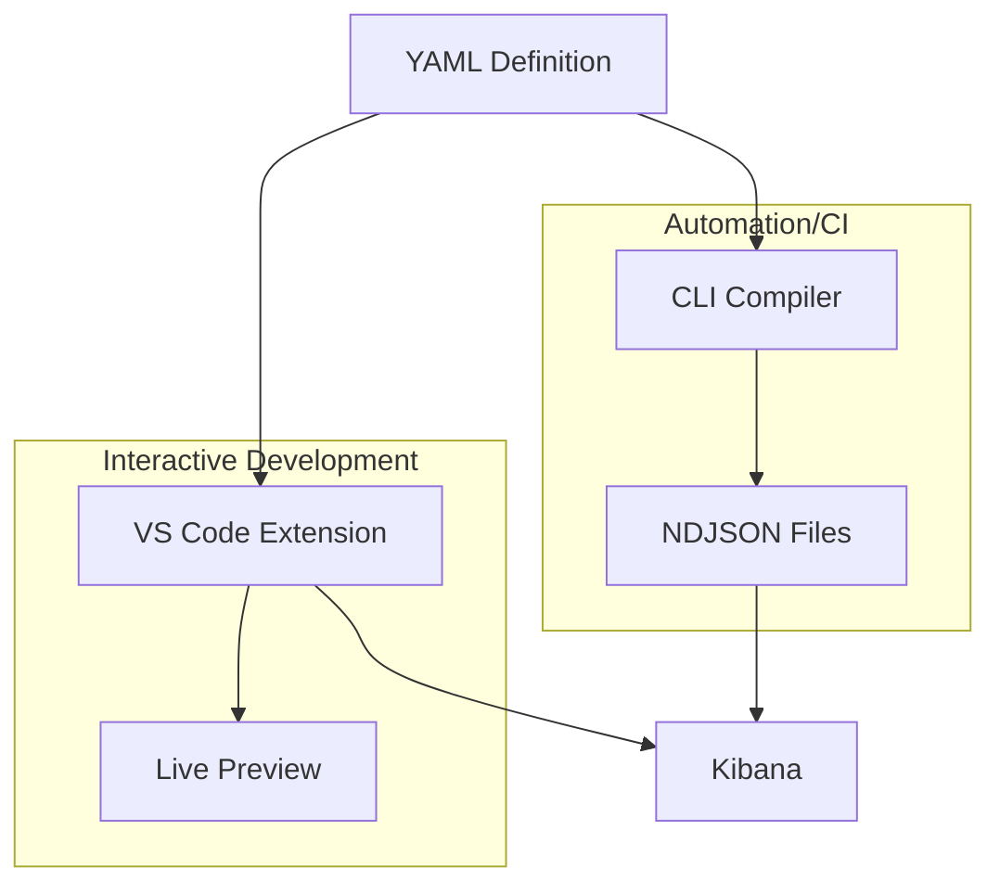

# YAML ➤ Lens Dashboard Compiler

Convert human-friendly YAML dashboard definitions into Kibana NDJSON format.


This tool simplifies the process of creating and managing Kibana dashboards by
allowing you to define them in a clean, maintainable YAML format instead of
hand-crafting complex JSON.

## Getting Started

### VS Code Extension (Recommended)

**Best for interactive development** - Live preview, visual editing, built-in snippets

**No Python installation required!** The extension includes a bundled LSP server binary.

**Installation:**

1. **Install the extension:**
   - **OpenVSX Registry** (Cursor, VS Code forks): Search "Kibana Dashboard Compiler"
   - **Manual**: Download `.vsix` from [releases](https://github.com/strawgate/kb-yaml-to-lens/releases)

2. **Create your first dashboard:**

   Create a new file called `my-dashboard.yaml` and add the following content:

   ```yaml
   dashboards:
   - name: My First Dashboard
     description: A simple dashboard with markdown
     panels:
       - title: Hello Panel
         markdown:
           content: |
             # Hello, Kibana!

             This is my first markdown panel.
         size: {w: 24, h: 15}
   ```

   Or use snippets: type `dashboard` and press Tab to insert a template.

3. **Preview your dashboard:**
   - Save the file (Ctrl+S) to auto-compile
   - Open Command Palette (Ctrl+Shift+P / Cmd+Shift+P)
   - Run **"YAML Dashboard: Preview Dashboard"**

4. **Upload to Kibana:**
   - Configure Kibana URL in VS Code settings
   - Run **"YAML Dashboard: Open in Kibana"**

**Full guide:** [VS Code Extension Documentation](vscode-extension.md)

---

### CLI (For Automation & Scripting)

**Best for:** CI/CD pipelines, batch processing, programmatic usage

**Requirements:** Python 3.12+

**Installation** using [uv](https://github.com/astral-sh/uv):

```bash
cd compiler
uv sync
```

**Your First Dashboard:**

1. Create `inputs/my-dashboard.yaml`:

   ```yaml
   dashboards:
   - name: My First Dashboard
     description: A simple dashboard
     panels:
       - title: Welcome
         size: {w: 24, h: 15}
         markdown:
           content: |
             # Welcome to Kibana!
   ```

2. Compile:

   ```bash
   cd compiler
   uv run kb-dashboard compile
   ```

3. Upload to Kibana:

   ```bash
   uv run kb-dashboard compile --upload --kibana-url http://localhost:5601
   ```

**Full guide:** [CLI Documentation](CLI.md)

---

## Features

- **YAML-based Definition** – Define dashboards, panels, filters, and queries in simple, readable YAML.
- **Kibana Integration** – Compile to NDJSON format compatible with Kibana 8+.
- **Rich Panel Support** – Support for Lens (metric, pie, XY charts), Markdown, Links, Image, and Search panels.
- **Color Palettes** – Choose from color-blind safe, brand, and other built-in color palettes.
- **Interactive Controls** – Add options lists, range sliders, and time sliders with chaining support.
- **Flexible Filtering** – Use a comprehensive filter DSL (exists, phrase, range) or raw KQL/Lucene/ESQL queries.
- **Direct Upload** – Compile and upload to Kibana in one step, with support for authentication and API keys.
- **Screenshot Export** – Generate high-quality PNG screenshots of your dashboards programmatically.

## More Examples

### Lens Metric Panel

Here's a dashboard with a Lens metric panel displaying a count:

```yaml
dashboards:
- name: Metric Dashboard
  description: A dashboard with a single metric panel
  panels:
    - title: Document Count
      type: lens
      size: {w: 24, h: 15}
      data_view: your-index-pattern-*
      chart:
        type: metric
        metrics:
          - type: count
            label: Total Documents
```

### Programmatic Alternative

While this guide focuses on YAML, you can also create dashboards entirely in Python code. This approach offers:

- Dynamic dashboard generation based on runtime data
- Type safety with Pydantic models
- Reusable dashboard templates and components
- Integration with existing Python workflows

See the [Programmatic Usage Guide](programmatic-usage.md) for examples and patterns.

## Next Steps

### Enhance Your Workflow

- **[VS Code Extension Features](vscode-extension.md)** - Visual grid editor, code snippets, keyboard shortcuts
- **[CLI Advanced Usage](CLI.md)** - Environment variables, API keys, CI/CD integration
- **[Dashboard Decompiling Guide](dashboard-decompiling-guide.md)** - Convert existing Kibana JSON dashboards to YAML
- **[Complete Examples](examples/index.md)** - Production-ready dashboard templates

### User Guide

Reference documentation for YAML dashboard syntax:

- **[Dashboard Configuration](dashboard/dashboard.md)** - Dashboard-level settings and options.
- **[Panel Types](panels/base.md)** - Available panel types (Markdown, Charts, Images, Links, etc.).
- **[Dashboard Controls](controls/config.md)** - Interactive filtering controls.
- **[Filters & Queries](filters/config.md)** - Data filtering and query configuration.

### Developer Guide

Advanced documentation for contributors and programmatic usage:

- **[Architecture Overview](architecture.md)** - Technical design and data flow.
- **[Programmatic Usage](programmatic-usage.md)** - Using the Python API directly to generate dashboards.
- **[API Reference](api/index.md)** - Auto-generated Python API documentation.
- **[Contributing Guide](https://github.com/strawgate/kb-yaml-to-lens/blob/main/CONTRIBUTING.md)** - How to contribute and add new capabilities.
- **[Kibana Architecture Reference](kibana-architecture.md)** - Understanding Kibana's internal structure.

## How It Works



## License

MIT

### Third-Party Content

Some example dashboards in `docs/examples/` are derived from the [Elastic integrations repository](https://github.com/elastic/integrations) and are licensed under the [Elastic License 2.0](https://github.com/strawgate/kb-yaml-to-lens/blob/main/licenses/ELASTIC-LICENSE-2.0.txt). Specifically:

- `docs/examples/system_otel/` - System monitoring dashboards for OpenTelemetry
- `docs/examples/docker_otel/` - Docker container monitoring dashboards for OpenTelemetry

See [licenses/README.md](https://github.com/strawgate/kb-yaml-to-lens/blob/main/licenses/README.md) for the complete list of affected files.

## Support

For issues and feature requests, please refer to the repository's issue tracker.
